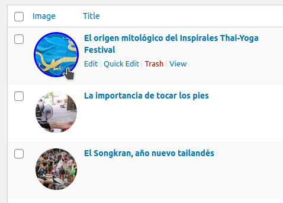
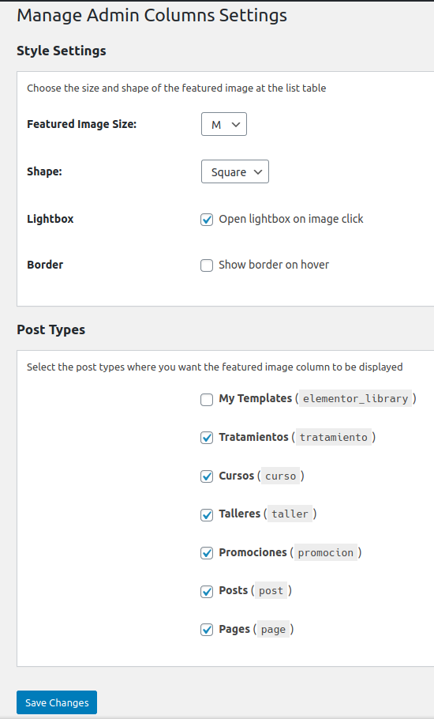

# Manage Admin Columns

## Description

This plugin adds a featured image column to WordPress Dashboard. It automatically adds a column to any post type which supports a featured image. It's an improvement from the plugin [Add Featured Image Column](https://wordpress.org/plugins/add-featured-image-column/).

## Requirements
* WordPress 4.1, tested up to 5.7

## Installation

### Upload

1. Download the latest tagged archive (choose the "zip" option).
2. Go to the __Plugins -> Add New__ screen and click the __Upload__ tab.
3. Upload the zipped archive directly.
4. Go to the Plugins screen and click __Activate__.

### Manual

1. Download the latest tagged archive (choose the "zip" option).
2. Unzip the archive.
3. Copy the folder to your `/wp-content/plugins/` directory.
4. Go to the Plugins screen and click __Activate__.

Check out the Codex for more information about [installing plugins manually](http://codex.wordpress.org/Managing_Plugins#Manual_Plugin_Installation).

### Git

Using git, browse to your `/wp-content/plugins/` directory and clone this repository:

`git clone git@github.com:sanbec/manage-admin-columns.git`

Then go to your Plugins screen and click __Activate__.

## Screenshots

  
_Circle, XL, border on hover posts featured images_

  
_Square, M, no border on hover posts featured images._

  
_Manage admin columns settings page._

  
_Featured Image Ligthbox._

## Frequently Asked Questions

It's simple! Just activate, adjust settings and enjoy.

## Credits

* Built by [Santiago Becerra](https://wpcombo.com/)

## Changelog

### 1.4.0
* new: Lightbox setting
* improvement: Remove border on hover for noimage placeholders
* improvement: Simpler lightbox effect with tickbox

### 1.3.1
* new: The image columm opens in a Ligthbox on click
* improvement: Move Image Column after the select checkbox
* improvement: Changed function prefixes to namespaces
* improvement: Convert class into static
* improvement: Better code structure
* improvement: Better code to order columns
* fix: Wrong metadata
* fix: Bad syntax

### 1.3.0
* new: setting to choose if the image border is shown on hover

### 1.2.0
* new: svg image for posts with no featured image
* improved: better code 

### 1.1.6
* changed: featured image column no longer loads (duplicate) for WooCommerce products

### 1.1.5
* improved: output for posts with no featured image

### 1.1.4
* fixed: featured image column display on mobile

### 1.1.3
* Improved: any post type which supports featured images (including private post types) will display a featured image column
* Added: the args to get the list of post types has been added to the post types filter
* Changed: admin column heading is just "Image" instead of "Featured Image"

### 1.1.2
* Added: text_domain, language files
* Fixed (really): featured image column on mobile

### 1.1.1
* Fixed: featured image column on mobile

### 1.1.0
* Added: the featured image column is now sortable.
* Due to redundancy, this plugin now deactivates if Display Featured Image for Genesis is active.

### 1.0.1
* Added filter to exclude post types

### 1.0.0
* Initial release on WordPress.org

### 0.9.0
* Initial release on Github
